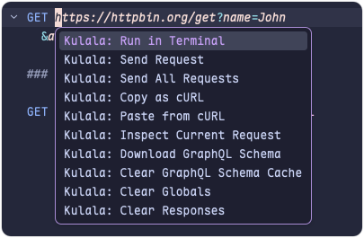

<div align="center">


# zed-kulala-http

An unofficial extension for Kulala, adding support for the Zed editor. Visit the [Kulala repository](https://github.com/mistweaverco/kulala.nvim) to unlock a whole new world!

</div>

## Features

- Syntax highlighting for `http` files
- Full support for `kulala` syntax completion
- Full support for `kulala` syntax diagnostics
- Built-in formatting
- Built-in request sending, no external dependencies required
- Support for `js/ts` scripts

## Installation

In the `Zed` editor, click your avatar to open the `Extensions` page, then search for `Kulala HTTP` to install.

## Usage

### Format file

`zed-kulala-http` supports the `format` operation. Add the following to your `settings.json` in the `Zed` editor to format on save:

```json
"languages": {
    "kulala-http": {
      "formatter": "language_server",
      "format_on_save": "on",
    },
}
```

### Send request

> [!caution]
> Due to the current limitations of `Zed`'s extension mechanism, we cannot fully replicate the `kulala.nvim` experience. We first ensure requests work correctly and provide history viewing. When `Zed`'s extension capabilities grow richer, there may be a better implementation; we will keep updating and optimizing.

#### Send request via Code Action

Using `Code Action` to send a request automatically creates a `.kulala-cache` folder in the current project to store request history. Records are kept for 7 days. You can also choose `Kulala: Clear Responses` from `Code Action` to clear the files.

Currently supported operations:

> You need to create a task containing `kulala-http-request` in your `tasks.json` for `Kulala: Run In Terminal` to appear.



#### Send request via run button

> [!IMPORTANT]
> Sending requests via the run button does not create cached files; it executes the request task directly in the `terminal`.

The run button is hidden by default. You need to create a task with the `kulala-http-request` tag for it to appear, for example:

```json
[
  {
    "label": "Kulala: Run in Terminal",
    "command": "node",
    "args": [
      "\"/Users/<UserName>/Library/Application Support/Zed/extensions/work/kulala-http/dist/cli.cjs\"",
      "run",
      "$ZED_FILE",
      "$ZED_ROW"
    ],
    "tags": ["kulala-http-request"],
    "reveal": "always",
    "allow_concurrent_runs": true,
    "use_new_terminal": true
  }
]
```

You can also enable auto-creation. When the `kulala-http` server starts, it will automatically create the task in the current project. To enable this, add the following to your `settings.json`:

```json
"lsp": {
  "kulala-ls": {
    "settings": {
      "autoCreateTask": true,
    },
}
```

## Special thanks

### kulala.nvim

kulala.nvim is an exceptionally well-crafted plugin that offers seamless compatibility with the IntelliJ HTTP Client. It's thanks to this outstanding project that the development of zed-kulala-http has been possible. The Tree-sitter grammar and LSP server used in this project are both derived from kulala.nvim. Our goal is to bring the same excellent development experience that kulala provides in Neovim to the Zed editor as well. Please support kulala.nvim! ❤️
